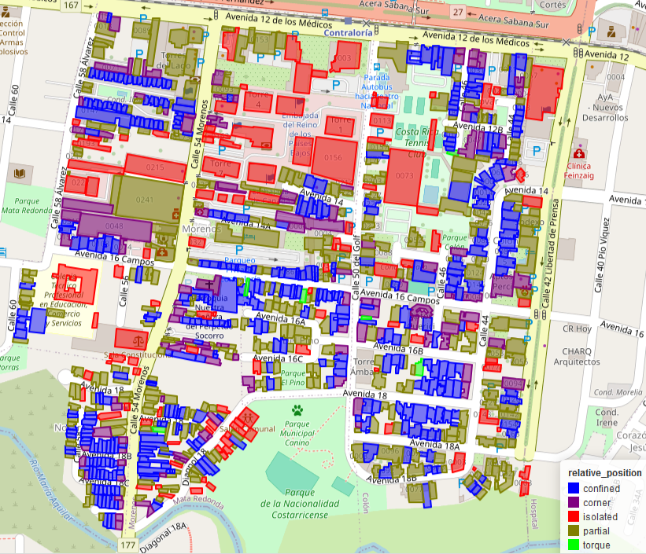

Under development

# SeismicBuildingExposure

**SeismicBuildingExposure** is a Python package built using GeoPandas to calculate various geometric indices related to building footprint geometry and seismic risk.

---

## Installation

To install the package, use the following command:

```bash
pip install git+https://github.com/GeomaticsCaminosUPM/SeismicBuildingExposure.git
```

---

## Features

### 1. **Relative Position of Buildings**
This feature determines if a building touches other structures (relative position within the city block). It calculates "forces" that neighboring structures exert on the building, proportional to the contact area (length of touching footprints multiplied by building height) in the normal direction of the touching plane.

Contact forces are computed to help determine the realtive position class:
- **`angular_acc`**:  
  The angular acceleration, calculated as:

$$\text{angular acc} = \frac{\text{momentum} \cdot \text{area}}{\text{inertia}}$$
   
  Where **momentum** is calculated as:
  
$$\text{momentum} = \sum \(\text{distance} \cdot |\text{force}_i|\)$$

- **`force`**:  
  The magnitude of the resultant force acting on the footprint, normalized by the square root of the area:
  
$$\text{force} = \left| \sum \text{force}_i \right|$$

- **`confinement_ratio`**:  
  The proportion of total forces that are confined (counterbalanced by opposing forces):
    
$$\text{confinement ratio} = \frac{\sum |\text{force}_i| - \left| \sum \text{force}_i \right|}{\left| \sum \text{force}_i \right|}$$

- **`angle`**:  
  The normalized sum of the angles between individual forces and the resultant force:
   
$$\text{angle} = \frac{\sum \left( |\text{force}_i| \cdot \text{angle}(\text{force}_i, \sum \text{force}_j) \right)}{\left| \sum \text{force}_i \right|}$$

Relative position classes are:
1. **"torque"**: High angular acceleration and class **confined** or **corner**.
2. **"confined"**: Touches on both lateral sides.
3. **"corner"**: Touches at a corner.
4. **"lateral"**: Touches on one side.
5. **"isolated"**: No touching structures.

<div align="center">
  
</div>

---

### 2. **Irregularity**
Measures geometric irregularity (**plan view**) of building footprints using various indices from different norms.

#### **Polsby-Popper Index**
Measures shape compactness (similarity to a circle).
##### **Formula:**
    
  $$\text{Polsby-Popper Index} = \frac{4 \pi A}{P^2}$$
  
  where:
  - \( A \): Area of the polygon.
  - \( P \): Perimeter of the polygon.

##### **Function: `polsby_popper`**
```python
polsby_popper(geoms: gpd.GeoDataFrame, convex_hull: bool = False) -> list
```

##### **Parameters:** 
- **`geoms`** (`gpd.GeoDataFrame`): GeoDataFrame with building footprint geometries.
- **`convex_hull`** (`bool`, optional): Use the convex hull of the geometries instead to compute the polsby popper index (default: `False`).
##### **Output:**
List of `polsby_popper` values corresponding to `geoms` rows.

---

#### **Custom Irregularity Index**
Quantifies the irregularity of footprints based on the diference between the boundary of the footprint and the convex hull.
##### **Formula:**
  
  $$\text{Custom Irregularity Index} = \frac{l \cdot d}{L}$$
  
  where:
  - \( l \): Length of the geometries outside the convex hull.
  - \( d \): Distance of the center of gravity of the geometries outside the hull to the convex hull.
  - \( L \): Total convex hull length.

**Note:** Footprint polygons and convex hulls are transformed into `LineStrings` based on their boundary.

##### **Function: `shape_irregularity`**
```python
shape_irregularity(geoms: gpd.GeoDataFrame) -> list
```

##### **Parameters**:  
- **`geoms`** (`gpd.GeoDataFrame`): GeoDataFrame with building footprint geometries.
##### **Output**: 
List of `shape_irregularity` values corresponding to `geoms` rows.

---

#### **Inertia Irregularity**
Compares the inertia of a polygon to a circle with the same area.
##### **Formula**:
  
  $$\text{Inertia Irregularity} = \frac{\text{Inertia of Equivalent Circle}}{\text{Inertia of Polygon}}$$

##### Function: `inertia_irregularity`
```python
inertia_irregularity(geoms: gpd.GeoDataFrame) -> list
```

##### **Parameters**:  
- **`geoms`** (`gpd.GeoDataFrame`): GeoDataFrame with building footprint geometries.
##### **Output**: 
List of `inertia_irregularity` values corresponding to `geoms` rows.

---


